# EXNO:4-FEATURE SCALING AND SELECTION
## AIM:
To read the given data and perform Feature Scaling and Feature Selection process and save the
data to a file.

## ALGORITHM:
STEP 1:Read the given Data.
STEP 2:Clean the Data Set using Data Cleaning Process.
STEP 3:Apply Feature Scaling for the feature in the data set.
STEP 4:Apply Feature Selection for the feature in the data set.
STEP 5:Save the data to the file.

## FEATURE SCALING:
1. Standard Scaler: It is also called Z-score normalization. It calculates the z-score of each value and replaces the value with the calculated Z-score. The features are then rescaled with x̄ =0 and σ=1
2. MinMaxScaler: It is also referred to as Normalization. The features are scaled between 0 and 1. Here, the mean value remains same as in Standardization, that is,0.
3. Maximum absolute scaling: Maximum absolute scaling scales the data to its maximum value; that is,it divides every observation by the maximum value of the variable.The result of the preceding transformation is a distribution in which the values vary approximately within the range of -1 to 1.
4. RobustScaler: RobustScaler transforms the feature vector by subtracting the median and then dividing by the interquartile range (75% value — 25% value).

## FEATURE SELECTION:
Feature selection is to find the best set of features that allows one to build useful models. Selecting the best features helps the model to perform well.
The feature selection techniques used are:
1.Filter Method
2.Wrapper Method
3.Embedded Method

## CODING AND OUTPUT:

### IMPORT THE LIBRARIES IN PYTHON:
```python
import pandas as pd
import numpy as np
import seaborn as sns

df=pd.read_csv("bmi.csv")
df.head()
```

### OUTPUT:
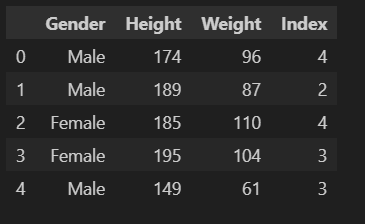

### DROP THE NULL VALUES:
```PYTHON
df.dropna()
```
### OUTPUT:

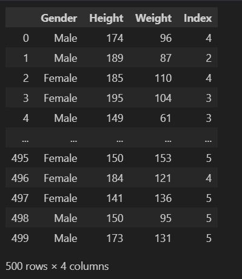

### TYPE CODE TO FIND MAXIMUM VALUE FROM HEIGHT AND WEIGHT FEATURE:
```PYTHON
max_vals=np.max(np.abs(df[['Height','Weight']]))
max_vals
```
### OUTPUT:


### PERFORM STANDARD SCALER:
```PYTHON
from sklearn.preprocessing import StandardScaler
sc=StandardScaler()
df1=pd.read_csv("bmi.csv")
df1[['Height','Weight']]=sc.fit_transform(df[['Height','Weight']])
df1.head(10)
```

### OUTPUT:
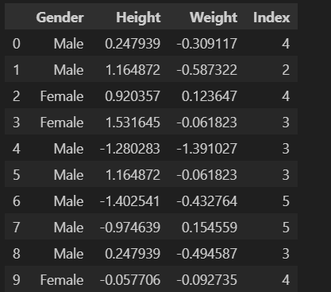

### PERFORM MINMAX SCALER:
```PYTHON
from sklearn.preprocessing import MinMaxScaler
scaler=MinMaxScaler()
df[['Height','Weight']]=scaler.fit_transform(df[['Height','Weight']])
df.head(10)
```

### OUTPUT:
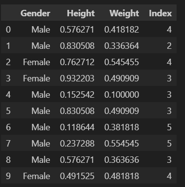

### PERFORM NORMALIZER:
```PYTHON
from sklearn.preprocessing import Normalizer
df2=pd.read_csv("bmi.csv")
scaler=Normalizer()
df2[['Height','Weight']]=scaler.fit_transform(df2[['Height','Weight']])
df2
```

### OUTPUT:
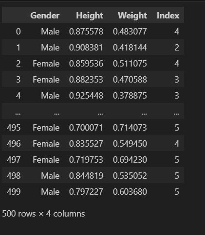


### PERFORM MAXABSSCALER:
```PYTHON
from sklearn.preprocessing import MaxAbsScaler
df3=pd.read_csv("bmi.csv")
scaler=MaxAbsScaler()
df3[['Height','Weight']]=scaler.fit_transform(df3[['Height','Weight']])
df3
```

### OUTPUT:
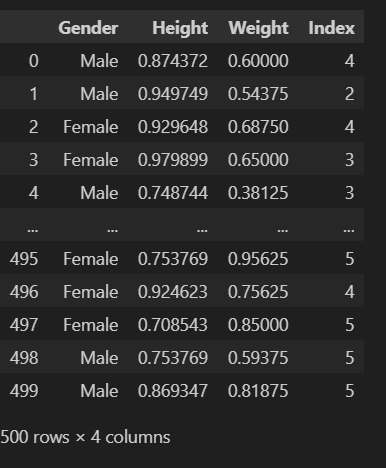

### PERFORM ROBUSTSCALER:
```PYTHON
from sklearn.preprocessing import RobustScaler
df4=pd.read_csv("bmi.csv")
scaler=RobustScaler()
df4[['Height','Weight']]=scaler.fit_transform(df4[['Height','Weight']])
df4
```

### OUTPUT:
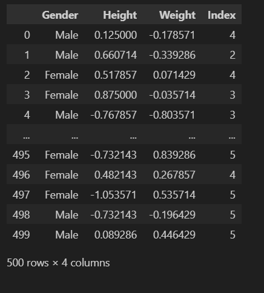

### IMPORT THE CERTAIN LIBRARIES:
```PYTHON
import pandas as pd
import numpy as np
import seaborn as sns
from sklearn.model_selection import train_test_split
from sklearn.neighbors import KNeighborsClassifier

from sklearn.metrics import accuracy_score,confusion_matrixdata=pd.read_csv("income(1) (1).csv",na_values=[" ?"])
data.head()
```

### OUTPUT:
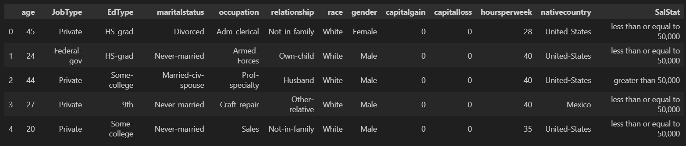

### CHECK THE NULL VALUES:
```PYTHON
data.isnull().sum()
```

### OUTPUT:
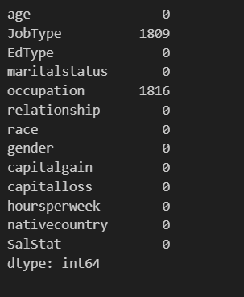

### CHECK THE MISSING DATASET:
```PYTHON
missing=data[data.isnull().any(axis=1)]
missing
``` 
### OUTPUT:
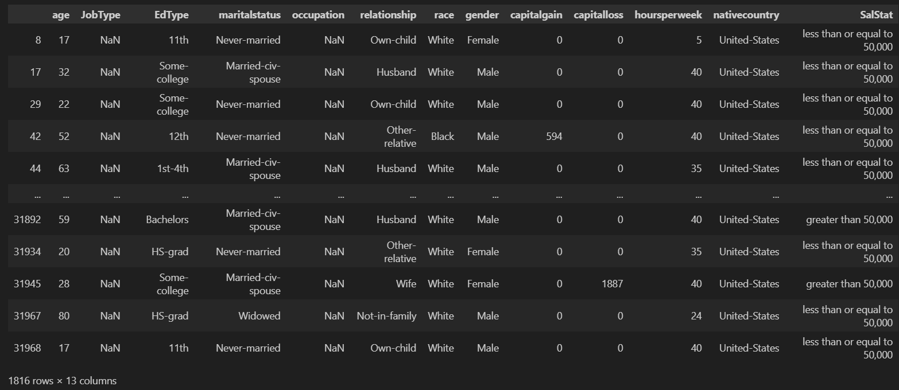

### DROP THE NULL VALUES WITH THE ROW SIDE:
```PYTHON
data2=data.dropna(axis=0)
data2.head()
```

### OUTPUT:
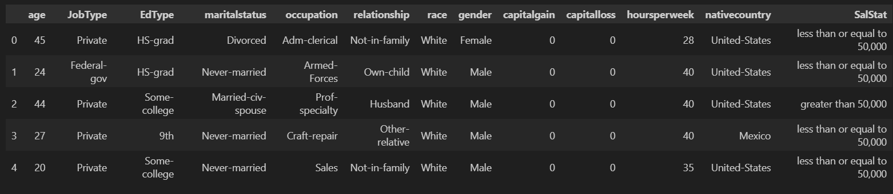

### 
```PYTHON
sal=data['SalStat']
data2['SalStat']=data2['SalStat'].map({' less than or equal to 50,000':0,' greater than 50,000':1})
print(data2['SalStat'])
```

### OUTPUT:
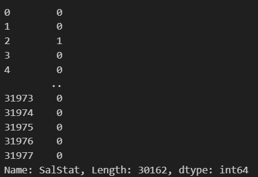

### 
```PYTHON
sal2=data2['SalStat']
dfs=pd.concat([sal,sal2],axis=1)
dfs
```

### OUTPUT:
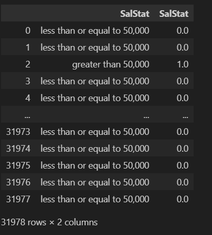

### DISPLAY THE DATASET:
```PYTHON
data2
```

### OUTPUT:
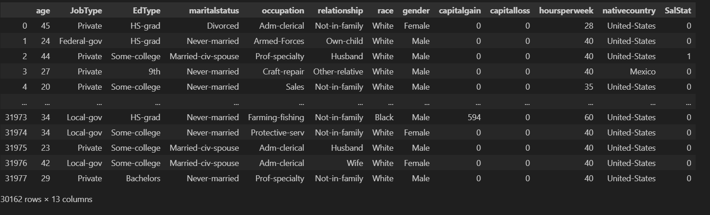


### GET THE DUMMIES COLUMNS:
```PYTHON
new_data=pd.get_dummies(data2,drop_first=True)
new_data
```

### OUTPUT:
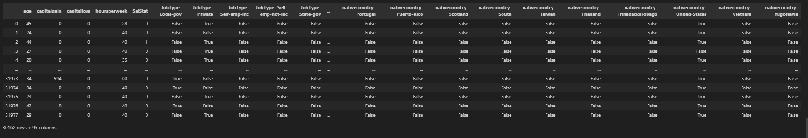


## FEATURE METHOD IMPLEMENTATION:
```PYTHON
columns_list=list(new_data.columns)
print(columns_list)
```

### OUTPUT:
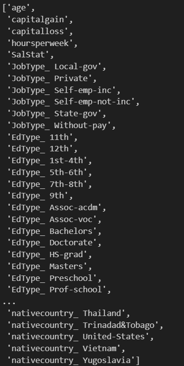


### REMOVE 'SalStat' FROM columns_list AND STORE IN features:
```PYTHON
features=list(set(columns_list)-set(['SalStat']))
print(features)
```

### OUTPUT:
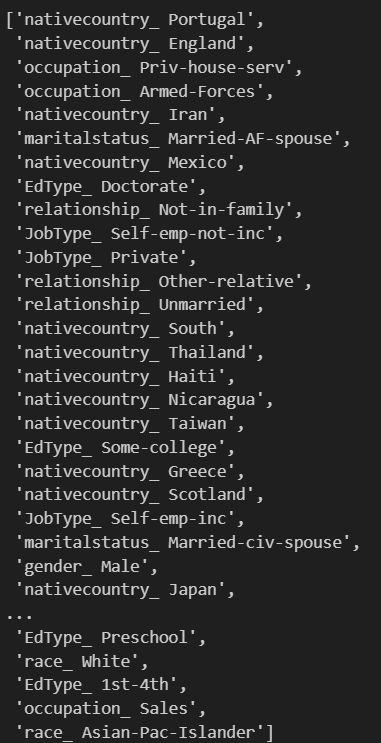

### EXTRACT FEATURE VALUES FROM new_data USING features:
```PYTHON
x=new_data[features].values
print(x)
```

### OUTPUT:
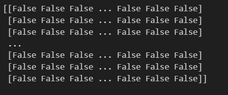

### EXTRACT 'SalStat' VALUES FROM new_data
```PYTHON
y=new_data['SalStat'].values
y
```

### OUTPUT:
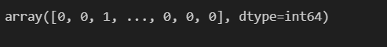

### SPLIT DATA INTO TRAINING AND TEST SETS:
### IMPORT AND INITIALIZE K-NEAREST NEIGHBORS CLASSIFIER:
### TRAIN KNN CLASSIFIER:
```PYTHON
train_x,test_x,train_y,test_y=train_test_split(x,y,test_size=0.3,random_state=0)
from sklearn.neighbors import KNeighborsClassifier
KNN_classifier=KNeighborsClassifier(n_neighbors=5)
KNN_classifier.fit(train_x,train_y)
```

### OUTPUT:
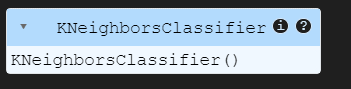

### PRINT SHAPE OF test_x:
```python
print(test_x.shape)
```

### OUTPUT:
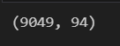

### MAKE PREDICTIONS ON test_x AND CALCULATE CONFUSION MATRIX:
```PYTHON
prediction=KNN_classifier.predict(test_x)
confusion=confusion_matrix(test_y,prediction)
confusion
```

### OUTPUT:
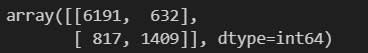

### CALCULATE ACCURACY SCORE:
```PYTHON
accuracy=accuracy_score(test_y,prediction)
accuracy
```

### OUTPUT:
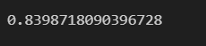

### PRINT NUMBER OF MISCLASSIFIED SAMPLES:
```PYTHON
print("Misclassified samples: %d" %(test_y!=prediction).sum())
```
### OUTPUT:
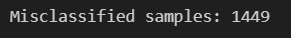

### PRINT THE SHAPE OF THE data DataFrame:
```PYTHON
data.shape
```
### OUTPUT:
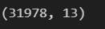

### LOAD THE 'TIPS' DATASET FROM SEARBORN:
### FEATURE SELECTION:
```PYTHON
tips=sns.load_dataset('tips')
tips.head()
```
### OUTPUT:
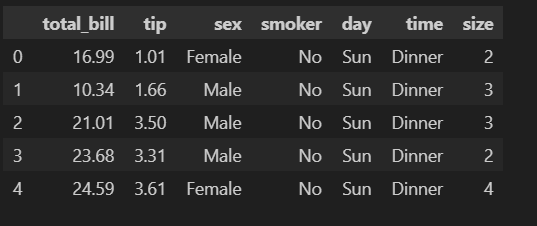

### IMPORT AND CREATE CONTINGENCY TABLE FROM 'tips' DATAFRAME:
```PYTHON
from scipy.stats import chi2_contingency

contingency_table=pd.crosstab(tips['sex'],tips['time'])
contingency_table
```

### OUTPUT:
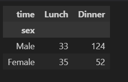

### IMPORT LIBRARIES AND CREATE CONTINGENCY TABLE FROM 'tips' DATAFRAME:
```PYTHON
chi2, p, _,_=chi2_contingency(contingency_table)
print('Chi-squared statistic:', chi2)
print('p-value:', p)
```

### OUTPUT:
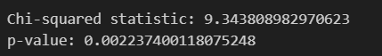

### IMPORT LIBRARIES AND CREATE DATAFRAME:
```PYTHON
from sklearn.feature_selection import SelectKBest, mutual_info_classif, f_classif

data={
    'Feature1':[1,2,3,4,5],
    'Feature2':['A','B','A','B','A'],
    'Feature3':[10,20,30,40,50],
    'Target':[0,1,0,1,0],
}

df=pd.DataFrame(data)
df
```

### OUTPUT:
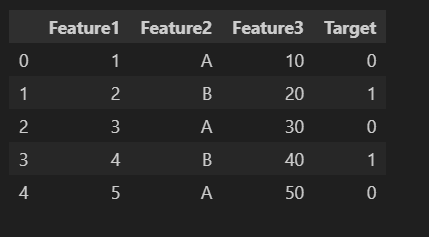

### SELECT FEATURES USING SelectKBest WITH MUTUAL INFORMATION:
```PYTHON
x=df[['Feature1','Feature3']]
y=df['Target']

selector=SelectKBest(score_func=mutual_info_classif,k=1)
selector.fit(x,y)
```

### OUTPUT:
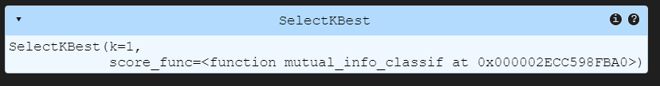

### TRANSFORM FEATURES USING THE FITTED SELECTOR:
```PYTHON
x_new=selector.fit_transform(x,y)
x_new
```
### OUTPUT:
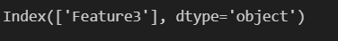

### 
```PYTHON
selected_features_indices=selector.get_support(indices=True)
selected_features_indices
```

### OUTPUT:
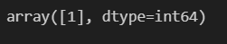

### GET INDICES OF SELECTED FEATURES:
```PYTHON
selected_features=x.columns[selected_features_indices]
selected_features
```

### OUTPUT:
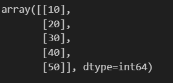

## RESULT:
The code were executed and done successfully the Feature Scaling and Selection.